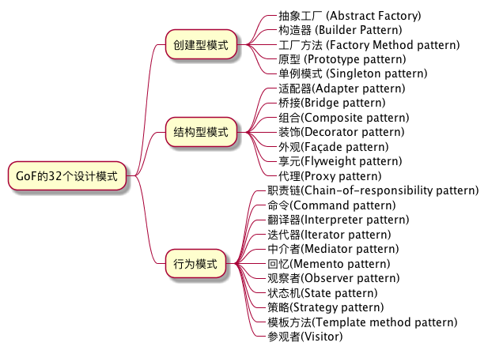

# Design Patterns exercises for JavaScript Developers.

## 一、为什么提出设计模式？

### 1.1 设计模式的起源

《建筑之永恒之道》——模式语言

 * 客观存在是复杂的，为了帮助我们认知，我们用抽象的方法*给客观存在建立模型*，并使用这些模型帮助人们之间的*交流*。
 * 事务可能存在多种不同视角的模型，因此当我们说到一个名词的时候，我们需要*结合上下文、常识和共同文化背景*，才可以了解彼此所指的是哪个事物在哪个视角下的模型。
 * 模式之道：它以*不自觉*的形式隐藏于所有的建筑方式背后——即*大道至简*。所有的建筑背后有一种普适原则，形式只是表象。

GoF的《设计模式》尝试借用这本书里面的模式语言这个理念，观察并发现出在软件设计里面普遍存在的一些模式，并把它们归纳整理成23个模式的例子，分成“创建型”、“结构型”、“行为型”三类。

同时，他们在书中也提出了设计模式的作用，以及避免误用的原则：

 * 设计模式为设计师们提供一种共通的词汇储备，帮助其*沟通、编写文档并探索设计方案*。
 * 理解本书中的设计模式能够帮助大家更轻松地*掌握现有系统*。
 * 人们很容易将模式视为一种解决方案，相比之下，人们很难弄清其更为确切的核心——即定义其能够解决的问题以及在哪些背景下才属于最佳解决方案。

### 1.2 设计模式的描述

书中设计出一系列用来描述设计模式，以及对软件设计模式进行归纳整理所需要的属性：

| 用于识别和交流模式  | 用于了解模式的如何运作 | 识别类似场景或关联的其他模式 |
| :------------------ | :--------------------- | :--------------------------- |
| 模式名和分类        | 结构、参与者、协作     | 相关模式                     |
| 意图                | 效果                   |                              |
| 别名                | 实现                   |                              |
| 动机                | 代码示例               |                              |
| 适用性              | 已知应用               | &nbsp;                       |

因为我们当前的目标是了解学习，而不是做索引归类，所以我们在教程里不打算列举每个模式的所有属性，而是用尽量简单的方式来介绍该设计模式的思想。

### 1.3 使用设计模式的三个层次

HFDP(Head First Design Pattern)的作者说，使用设计模式有3个层次：

* Beginner——初级的时候无处不用设计模式，认为用的模式越多，设计就越好
* Intermediate——中级的时候知道何时该用什么设计模式，什么时候不该用
* Zen——到了禅的境界，设计模式被用来简化设计，让设计更优雅

### 1.4 反模式

反面模式（anti-pattern或antipattern）指的是在实践中明显出现但又低效或是有待优化的设计模式，是用来解决问题的带有共同性的不良方法。

它们已经经过研究并分类，以防止日后重蹈覆辙，并能在研发尚未投产的系统时辨认出来。

按《AntiPatterns》作者的说法，可以用至少两个关键因素来把反面模式和不良习惯、错误的实践或糟糕的想法区分开来：

  * 行动、过程和结构中的一些重复出现的乍一看是有益的，但最终得不偿失的模式
  * 在实践中证明且可重复的清晰记录的重构方案

## 二、GoF（Gang of Four，四人帮）23个设计模式

《设计模式：可复用面向对象软件的基础》这本书里面，四位作者整理了23个设计模式，分别归类到3个范例的类别里面。

> We don’t consider this collection of design patterns complete and static; it’s more a recording of our current thoughts on design.
>
> - 《Design Patterns：Elements of Reusable Object-Oriented Software》

他们认为这这并不是软件所有的设计模式，而仅仅是一个对过去设计思想的记录。

## 三、本教程的设计

在这个教程里，对一个设计模式的讲解有三部分：

 - 设计模式介绍
 - 设计模式的案例
 - 设计模式的练习

每一个设计模式会以“序号-模式名字”单独建一个目录，在目录里面包括：

 * README.md，关于这个模式的内容介绍
 * examples，存放这个模式的案例，作为讲解的材料
 * exercises，存放每个模式的练习题目，以及每个人可以在该目录下编写自己的答案版本，以自己的id为目录名。

本教程中的例子会尽量以TypeScript的形式来编写，因为TypeScript的语言更接近OO语言的表达形式，同时也是让大家从JavaScript转向TypeScript的练习机会。

## 四、设计模式列表

本教程里面的设计模式的顺序，并非按照GoF的设计模式列表或其他书籍的顺序，而是按照我们在JavaScript里面容易见到的场景，结合项目的需要来排优先级，按准备情况而确定的。

| 编号     | 设计模式名字                             |
| :------ | :------------------------------------- |
| 01      | [抽象工厂（Abstract Factory）](01-abstract-factory/README.md)             |
| 02      | [单例（Singleton）](02-singleton/README.md)                       |

## 其他参考

[Design Patterns in JS(GoF 23)](https://github.com/fbeline/design-patterns-JS)
[StarUML Design Patterns(GoF 23)](https://github.com/loredanacirstea/staruml-design-patterns)
[React in Patterns(中文版)](https://github.com/SangKa/react-in-patterns-cn)
[React Design Patterns and Best Practices](https://github.com/MicheleBertoli/react-design-patterns-and-best-practices)
